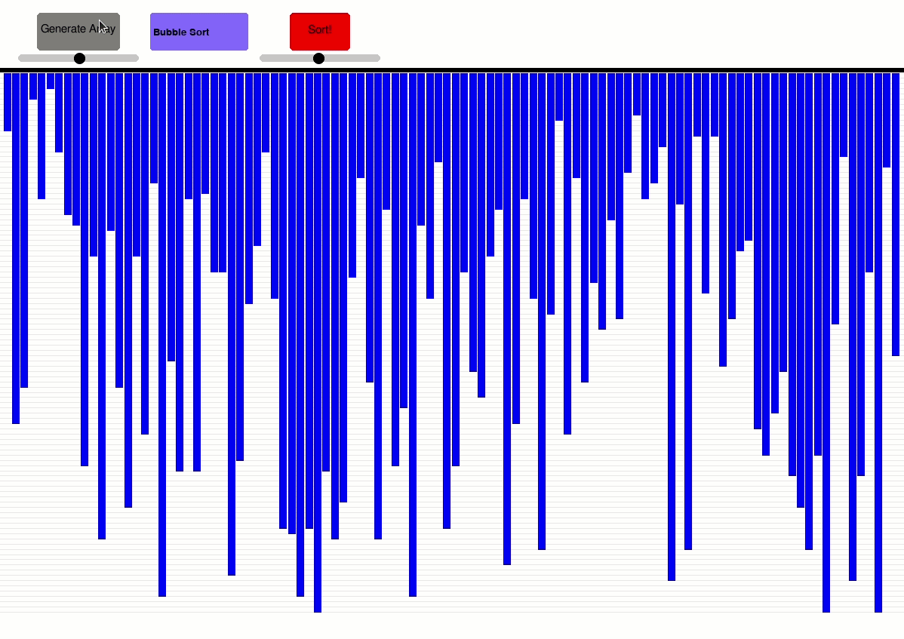

# Sorting-Algorithms-Visualizer
Made in Pythong with Pygame modules.
 

## Program preview

## Algorithms

| | | |
|:-------------------------:|:-------------------------:|:-------------------------:|
|  Bubble sort |   Heap sort | Mergesort |
| Quicksort |   Selection sort | Insertion sort |

## Using the visualizer
- Clone repo
- Install requirements: `pip3 install -r requirements.txt`
- Run: `python3 main.py`

